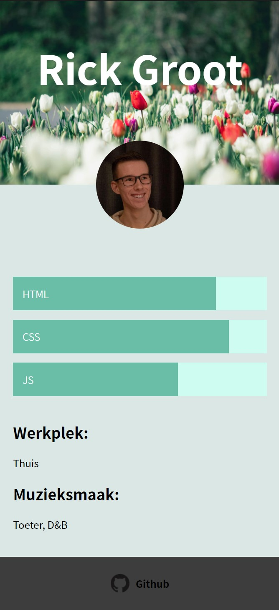

# Minor Web Design & Development Kickoff 2021


<!-- Add a link to your live demo in Github Pages 🌐-->
## Link naar card
https://rickgroot.github.io/kickoff-2021/

<!-- ☝️ replace this description with a description of your own work -->
## About
Ik studeer CMD aan de HvA, richting de technische kant. Mijn CSS en HTML skills zijn best wel goed, en mijn JS skills iets minder, maar evengoed wel goed genoeg.

<!-- Add a nice poster image here at the end of the week, showing off your shiny frontend 📸 -->
## Card


<!-- What external data source is featured in your project and what are its properties 🌠 -->
## API
Voor dit project heb ik een API gebruikt die mijn data bevat. Dit is de datastructuur van de API die ik gebruik in dit project.
```JS
{
    id: 12,
    teamId: 6,
    name: 'Rick',
    avatar: '',
    createdAt: '',
    prefix: '',
    surname: 'Groot',
    mugshot: 'https://avatars.githubusercontent.com/u/58476652?s=460&u=81df46ee550dbd4e2b48eb7c7d6208727a154cd1&v=4',
    githubHandle: 'https://github.com/RickGroot',
    other: {
        sport: 'N/A',
        muziek: 'Toeter, D&B',
        werkplek: 'Thuis'
    }
}
```

<!-- Maybe a checklist of done stuff and stuff still on your wishlist? ✅ -->

<!-- How about a license here? 📜 (or is it a licence?) 🤷 -->
## Licence
[](https://opensource.org/licenses/MIT)# Licence
[](https://opensource.org/licenses/MIT)